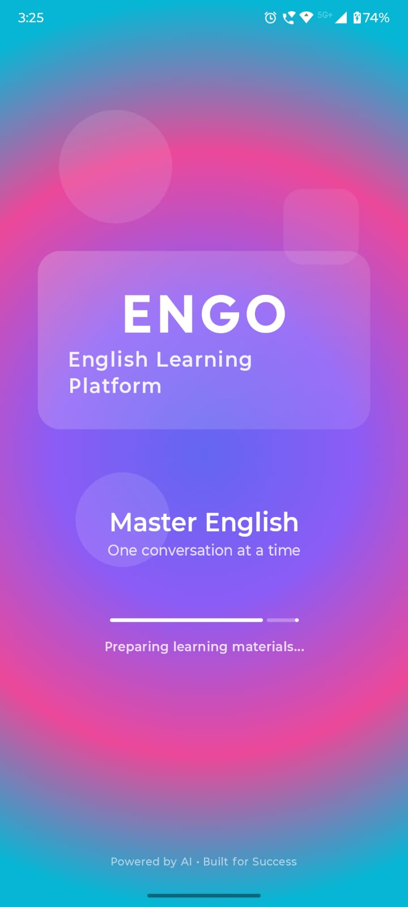
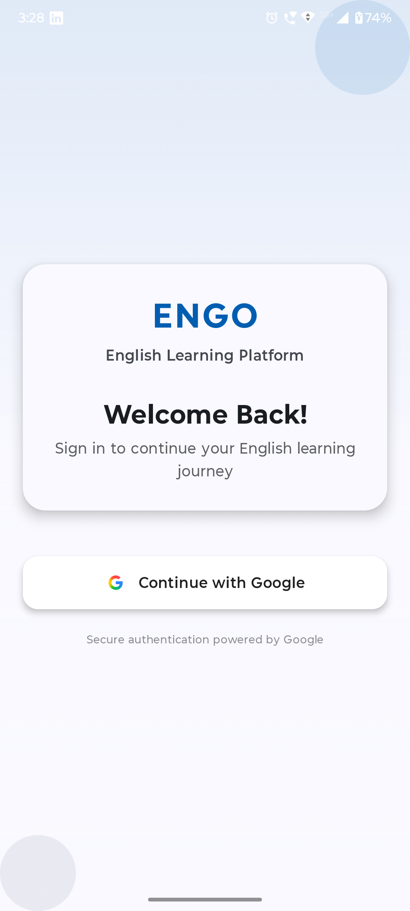
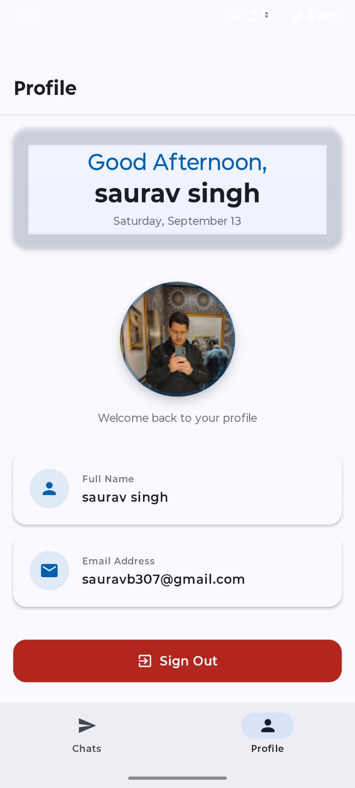

ENGO – Learn English the Smart Way

ENGO is an Android application designed to help users improve their English skills through interactive learning, grammar correction, and quizzes. The app leverages Firebase for authentication and Google Gemini AI for grammar validation, making it a fun and effective way to practice English.

🚀 Features

Splash Screen with Progress Animation – Engaging introduction before entering the app.

User Authentication (Firebase) – Secure login and signup functionality.

Grammar Check with AI (Gemini) – Ensures user messages are grammatically correct before sending.

Quiz-Based Learning – English grammar quizzes and fill-in-the-blank exercises.

Interactive UI with Jetpack Compose – Modern and smooth user interface.

🛠️ Tech Stack

Language: Kotlin

UI Framework: Jetpack Compose

State Management: ViewModel + LiveData / State

Authentication: Firebase Auth

AI Integration: Google Gemini API

Navigation: Jetpack Navigation Component

Architecture: MVVM

📱 Screenshots
Splash Screen	Login	Home
### Splash Screen

### Login Screen

Profile Screen	
### Profile Screen

👉 Place your screenshots in a screenshots/ folder at the root of your project and replace the placeholders.

🔮 Future Scope

We aim to expand ENGO into a daily learning companion with exciting new features:

📅 Daily Quiz:

Users will receive a fresh quiz every day.

Questions will focus on grammar, vocabulary, and sentence formation.

🏆 Leaderboard & Ranking System:

Users can compete with friends and other learners.

Rankings will be based on daily quiz scores.

Motivation through streaks, badges, and rewards.

📊 Progress Tracking:

Personalized dashboards to track improvement over time.

Insights on strengths and weaknesses in English grammar.

🤝 Community Features:

Group challenges and peer learning.

Real-time chat (with grammar correction enforced).

🏗️ Installation

Clone the repo

git clone https://github.com/your-username/ENGO.git

Open in Android Studio

Set up Firebase Project and add google-services.json

Add your Gemini API Key in local.properties

GEMINI_API_KEY=your_api_key_here

Build & run the project on an emulator or device.

🤝 Contribution

We welcome contributions! Feel free to:

Report issues

Suggest new features

Submit pull requests
